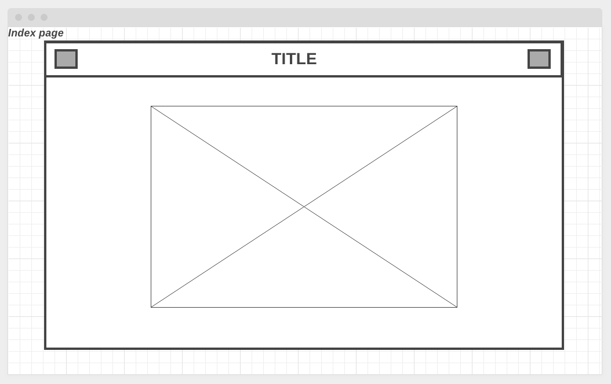
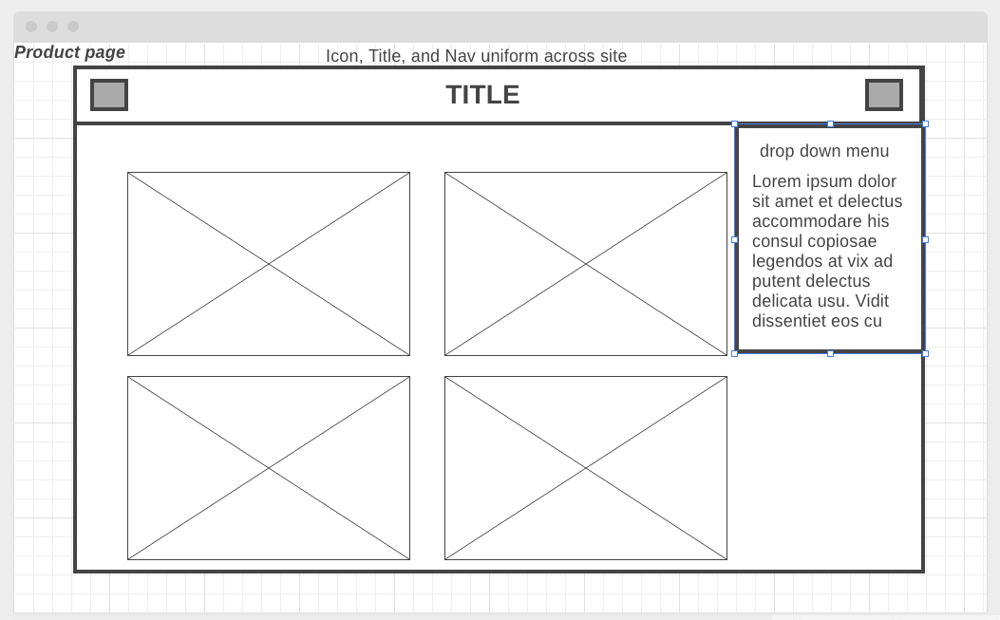
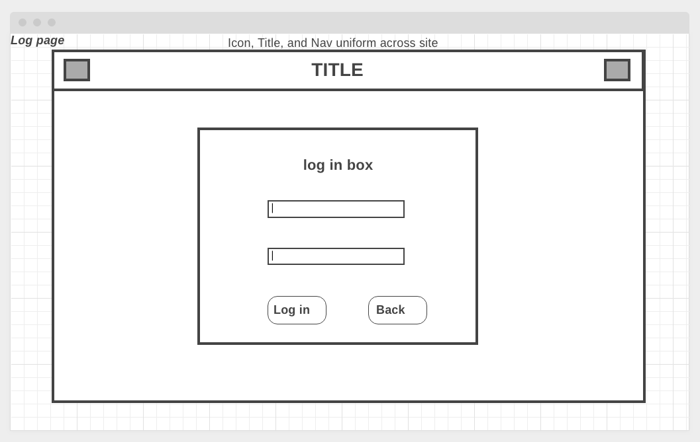
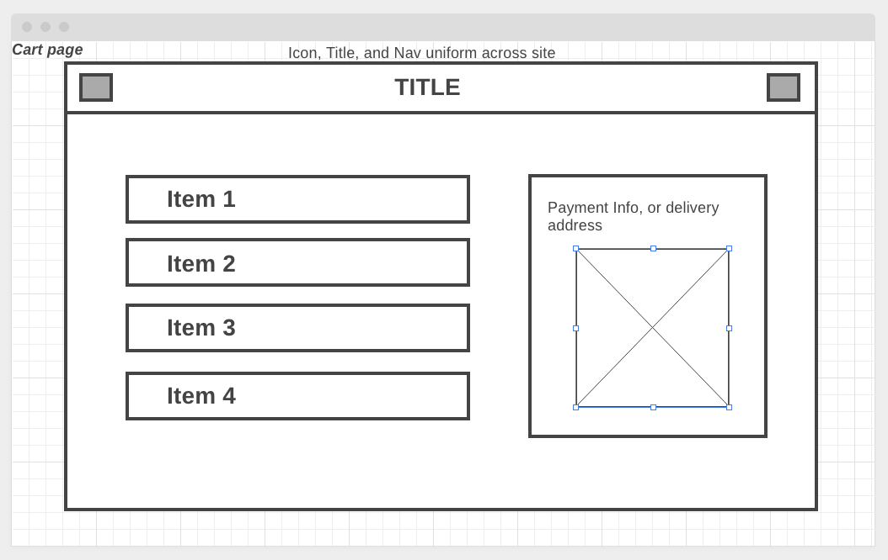

Joergen's Jellies:
=====
A website for Jeorgen to sell his jellies 

Wireframes:
=====

Screenshots:
===== 

Technologies Used:
=====
HTML5
JavaScript
Node.js
Confetti.js
Express
MongoDB
Mongoose
Google Oauth
https://jorgensjellies.herokuapp.com/

User Stories: 
=====
AAU I want to be able view my product, their descriptions, and add it to a cart
AAU I want to be able to log in to purchase above product
AAU I want to be able to view my cart if I leave the page without purchasing anything

Next Steps:
=====
Adjust the login/ logout to appear in the same place, a fized spot on the far right of the nav bar
Refactor the product line into a forEach so it will display any number of items
Refactor the nav bar to be floating at the top rather than fixed in the top/middle
Refactor the pages so there is less travel between pages with very little on them
Add links to the businesses' social media in a partial footer 

In the furture I would like to add a community input area on the main page or allow comments on the products
AAU, I would like to be able to access links to the businesses' social media 
AAU, I would like to see new featured items and read testimonials/ reviews from the initial loading page
 